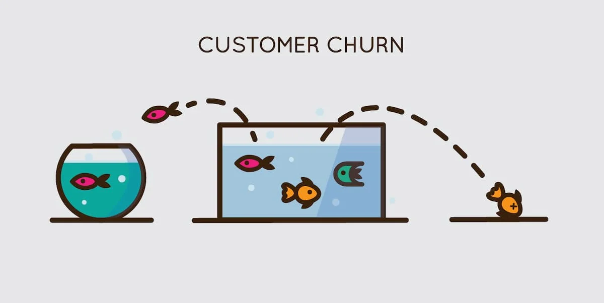

# Previsão de Churn 
O objetivo deste Readme é mostrar o contexto do problema, os passos dados para resolvê-lo, os principais insights e o desempenho geral.

## 1. Problema de Negócio
O TopBank é um banco que opera em três países europeus. Seu principal serviço é uma conta bancária que funciona com outros serviços como cartões de crédito, pagamentos e outros. Os contratos são válidos por 12 meses, após um ano o cliente poderá ou não renová-lo. Não há cobrança pelos serviços bancários.

O modelo de faturaento do banco por conta de cliente: 
- 15% do salário estimado do cliente, para clientes com rendimento estimado inferior à média; 
- 20% do salário estimado do cliente, para clientes com renda estimada superior à média. Problema. 

Nos últimos meses o TopBank notou um crescimento acelerado em sua taxa de churn. O desafio é entender as métricas que indicam um possível churn e ajudá-las a reduzir a taxa de churn. 

## 2. Premissa de Negócio
Os dados foram extraidos de uma competição disponivel no [Kaggle](https://www.kaggle.com/datasets/mervetorkan/churndataset)

Atributos      | Definição
-------------- | ---------------
|RowNumber     | Corresponde ao número do registro (linha) e não tem efeito na saída.|
|CustomerId    | Identificador único do cliete, contém valores aleatórios e não tem efeito na saída do cliente do banco.|
|CreditScore   | Pontuação de crédito de clientes para o mercado financeiro.|
|Geography     | O país do cliente.|
|Gender        | Representa o genero do crédito.|
|Age           | Idade do cliente|
|Tenure        | Número de anos que o cliente está no banco.|
|Balance       | O valor que o cliente tem em sua conta.|
|Tenure        | Número de anos que o cliente está no banco.|
|NumOfProducts | o número de produtos que o cliente comprou.|
|HasCrCard     | Indica se o cliente tiver um cartão de crédito.|
|IsActiveMember| Indica se o cliente estiver ativo (nos últimos 12 meses).|
|EstimatedSalary| Estimativa de salário anual de clientes.|
|Exited         | Indica se o cliente for um churn.|

## 3. Estratégia de Solução

**01. Descrição dos Dados:** O objetivo é usar métricas estatísticas e analise descritiva, como dimensão dos dados e tipos de atributos para identificar dados fora do escopo de negócio.  

**02. Feature Engineering:** Tem como objetivo derivar as variáveis originais, obtendo variáveis que descrevem melhor o fenômeno que será modelado.

**03. Filtragem:** Filtrar linhas e selecionar colunas que não estejam relacionadas com informações para a modelagem e que não correspondam ao escopo de negócio. 

**04. Análise exploratória de dados:** Objetivo de explorar os dados ganhando experiência sobre o negócio, encontrar insights validando as hipóteses de negócio e entender melhor o impacto das variáveis no aprendizagem do modelo. 

**05. Modelagem de Dados:** Preparar os dados para que o modelo aprenda o comportamento do fenômeno.

**06. Seleção de Variáveis:** Seleção dos atributos mais significativas, tornando o modelo simples e garantindo que aprenda o suficiente para generalizar todos os exemplos.

**07. Modelagem de Machine Learning:** Implementar e treinar modelos de Machine Learning.

**08. Hyperparameter Fine Tunning:** Encontrar o conjunto de valores para os parâmetros do modelo selecionado na etapa anterior, com objetivo de maximizar o aprendizado. 

**09. Avaliação do Modelo e Conversão do Modelo em Valores de Negócio:** Converter o desempenho do modelo machine learning em um resultado de negócios.

**10. Implementar Modelo em Produção:** Publicar o modelo em ambientem nuvem para tornar os resultados acessíveis para qualquer consumidor seja pessoa ou serviços. 

## 4. Top 3 Inseghts

**Hipótese 01:** Clientes com Saldo maior que a media estão 30% menos presentes em churn.
**Falso** Clientes com Saldo maior que a média estão 40% mais presentes em Churn que clientes com saldo menor.

**Hipótese 02:** Clientes com Credit Score menor que a media do pais tem Churn 10% maior.
**True** O número de clientes em Churn com credit score menor que a média de seu pais é 7% menor que clientes com credt score maior.

**Hipótese 03:**  Churn é 25% maior para clientes com apenas um produto comprado.
**True** Clientes com apenas um produto comprado podem ser ate 60% mais presentes em Churn que clientes que compraram mais produtos.

## 5. Modelo de Machine Learning
**Hipótese 01:**
